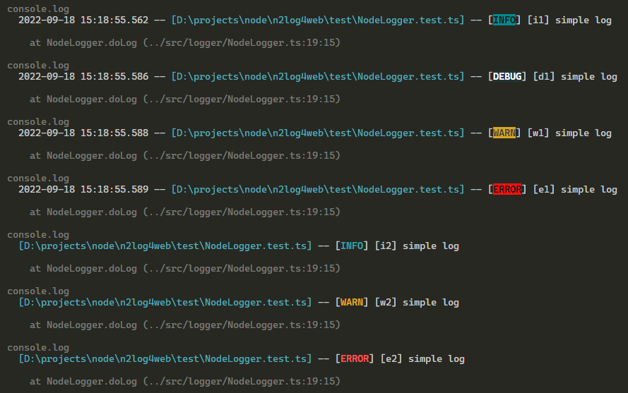

# n2log4web

> a simple logger for web, node and browser

---

## Usage

```typescript
import {
  LogFactory,
  LoggerConfig,
  LogLevel,
} from "@nmhillusion/n2log4web/core/index";

test("test simple log with setting default config", () => {
  LogFactory.setDefaultConfig(
    new LoggerConfig()
      .setLoggableLevel(LogLevel.DEBUG)
      .setFocusType("background")
  );

  const logger = LogFactory.getNodeLog(__filename);

  logger.info("[i1] simple log");
  logger.debug("[d1] simple log");
  logger.warn("[w1] simple log");
  logger.error("[e1] simple log");

  const logger2 = LogFactory.fromConfig(
    new LoggerConfig().setIncludingTimestamp(false)
  ).getNodeLog(__filename);

  logger2.info("[i2] simple log");
  logger2.debug("[d2] simple log");
  logger2.warn("[w2] simple log");
  logger2.error("[e2] simple log");
});
```

## Output

